# Neung W Ha

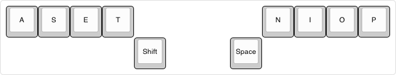

Neung W Ha (Thai for 1w5) is a keyboard with 10 keys. The name is inspired by the [3w6](https://github.com/weteor/3W6) keyboard by Weteor. The default layout is based on [ASETNIOP](https://www.asetniop.com/) and adapted from this keyboard layout: [3w6 Neung W Ha](https://github.com/joakimwinum/vial-qmk-3w6-neung-w-ha/tree/vial/keyboards/keebart/3w6_neung_w_ha).

There is currently no standard Neung W Ha keyboard; instead, it is a layer mapped onto other keyboards that support [QMK Firmware](https://qmk.fm/).

It is assumed that the computer attached to the keyboard is set to the English (US) keyboard layout. The symbols might not be the same otherwise.

## Layers

This keyboard uses 10 keys and 10 layers and aims to be a fully usable keyboard.

- Layers 0 and 1 contain most of the symbols.
- Layer 2 is a transition layer, which makes it possible to move from any layer to any other layer via Layer 2.  
  It is still possible to move from Layer 0 to Layer 1 and from Layer 1 to Layer 0 as a legacy feature.
- Layers 3 and 4 are for navigation.
- Layers 5 and 6 are mostly media-related.
- Layers 7 to 9 are for F1-F12.

The combos on this keyboard range from 1 to 4 keys, with most being 2 keys.

The keys/combos register when keys are released, allowing you time to type combos in any order.

Some combos have intentionally not been mapped and are marked with N/A (not assigned).

Sticky buttons keep their state until you click another button. Clicking a sticky button twice keeps its state until you click it again.

_Note: Sticky buttons are not perfectly configured and may lose their state after 5 seconds._

The images were created using [keyboard-layout-editor](https://www.keyboard-layout-editor.com/).

### Layer 0

| 1 | 2 | 3 | 4 |Sft|Spc| 7 | 8 | 9 | 0 | Result |
|:---:|:---:|:---:|:---:|:---:|:---:|:---:|:---:|:---:|:---:|---|
| x |   |   |   |[ ]|[ ]|   |   |   |   | a |
| x |   |   |   |[x]|[ ]|   |   |   |   | A |
|   |   |   | x |[ ]|[ ]| x |   |   |   | b |
|   |   |   | x |[x]|[ ]| x |   |   |   | B |
|   | x |   | x |[ ]|[ ]|   |   |   |   | c |
|   | x |   | x |[x]|[ ]|   |   |   |   | C |
|   | x | x |   |[ ]|[ ]|   |   |   |   | d |
|   | x | x |   |[x]|[ ]|   |   |   |   | D |
|   |   | x |   |[ ]|[ ]|   |   |   |   | e |
|   |   | x |   |[x]|[ ]|   |   |   |   | E |
| x |   |   | x |[ ]|[ ]|   |   |   |   | f |
| x |   |   | x |[x]|[ ]|   |   |   |   | F |
|   |   |   | x |[ ]|[ ]|   |   | x |   | g |
|   |   |   | x |[x]|[ ]|   |   | x |   | G |
|   |   |   |   |[ ]|[ ]| x | x |   |   | h |
|   |   |   |   |[x]|[ ]| x | x |   |   | H |
|   |   |   |   |[ ]|[ ]|   | x |   |   | i |
|   |   |   |   |[x]|[ ]|   | x |   |   | I |
|   | x |   |   |[ ]|[ ]| x |   |   |   | j |
|   | x |   |   |[x]|[ ]| x |   |   |   | J |
|   | x |   |   |[ ]|[ ]|   | x |   |   | k |
|   | x |   |   |[x]|[ ]|   | x |   |   | K |
|   |   |   |   |[ ]|[ ]|   | x | x |   | l |
|   |   |   |   |[x]|[ ]|   | x | x |   | L |
|   |   |   |   |[ ]|[ ]| x |   |   | x | m |
|   |   |   |   |[x]|[ ]| x |   |   | x | M |
|   |   |   |   |[ ]|[ ]| x |   |   |   | n |
|   |   |   |   |[x]|[ ]| x |   |   |   | N |
|   |   |   |   |[ ]|[ ]|   |   | x |   | o |
|   |   |   |   |[x]|[ ]|   |   | x |   | O |
|   |   |   |   |[ ]|[ ]|   |   |   | x | p |
|   |   |   |   |[x]|[ ]|   |   |   | x | P |
| x |   |   |   |[ ]|[ ]| x |   |   |   | q |
| x |   |   |   |[x]|[ ]| x |   |   |   | Q |
|   |   | x | x |[ ]|[ ]|   |   |   |   | r |
|   |   | x | x |[x]|[ ]|   |   |   |   | R |
|   | x |   |   |[ ]|[ ]|   |   |   |   | s |
|   | x |   |   |[x]|[ ]|   |   |   |   | S |
|   |   |   | x |[ ]|[ ]|   |   |   |   | t |
|   |   |   | x |[x]|[ ]|   |   |   |   | T |
|   |   |   |   |[ ]|[ ]| x |   | x |   | u |
|   |   |   |   |[x]|[ ]| x |   | x |   | U |
|   |   |   | x |[ ]|[ ]|   | x |   |   | v |
|   |   |   | x |[x]|[ ]|   | x |   |   | V |
| x | x |   |   |[ ]|[ ]|   |   |   |   | w |
| x | x |   |   |[x]|[ ]|   |   |   |   | W |
| x |   | x |   |[ ]|[ ]|   |   |   |   | x |
| x |   | x |   |[x]|[ ]|   |   |   |   | X |
|   |   | x |   |[ ]|[ ]| x |   |   |   | y |
|   |   | x |   |[x]|[ ]| x |   |   |   | Y |
| x |   |   |   |[ ]|[ ]|   | x |   |   | z |
| x |   |   |   |[x]|[ ]|   | x |   |   | Z |
|   |   |   |   |[ ]|[ ]|   | x |   | x | ! |
|   |   |   |   |[x]|[ ]|   | x |   | x | @ |
|   |   | x |   |[ ]|[ ]|   |   |   | x | ' |
|   |   | x |   |[x]|[ ]|   |   |   | x | " |
|   |   |   |   |[ ]|[ ]|   |   | x | x | ; |
|   |   |   |   |[x]|[ ]|   |   | x | x | : |
|   |   | x |   |[ ]|[ ]|   | x |   |   | , |
|   |   | x |   |[x]|[ ]|   | x |   |   | < |
|   | x |   |   |[ ]|[ ]|   |   | x |   | . |
|   | x |   |   |[x]|[ ]|   |   | x |   | > |
| x |   |   |   |[ ]|[ ]|   |   |   | x | ? |
| x |   |   |   |[x]|[ ]|   |   |   | x | / |
| x |   |   |   |[ ]|[ ]|   |   | x |   | ( |
| x |   |   |   |[x]|[ ]|   |   | x |   | [ |
|   | x |   |   |[ ]|[ ]|   |   |   | x | ) |
|   | x |   |   |[x]|[ ]|   |   |   | x | ] |
|   |   | x |   |[ ]|[ ]|   |   | x |   | - |
|   |   | x |   |[x]|[ ]|   |   | x |   | _ |
| x |   |   |   |[ ]|[ ]|   | x | x |   | Sticky Ctrl + Alt |
|   | x |   |   |[ ]|[ ]|   | x | x |   | Sticky Ctrl |
|   |   | x |   |[ ]|[ ]|   | x | x |   | Sticky Gui |
|   |   |   | x |[ ]|[ ]|   | x | x |   | Sticky Alt |
| x |   |   | x |[ ]|[ ]| x |   |   | x | Layer 1 |
|   | x | x |   |[ ]|[ ]|   | x | x |   | Layer 2 |
|   |   |   | x |[ ]|[ ]|   |   |   | x | Backspace |
| x | x | x | x |[ ]|[ ]|   |   |   | x | Tab |
|   |   |   |   |[ ]|[ ]| x | x | x | x | Enter |
|   |   |   |   |[x]|[ ]|   |   |   |   | Sticky Shift |
|   |   |   |   |[ ]|[x]|   |   |   |   | Space |

### Layer 1

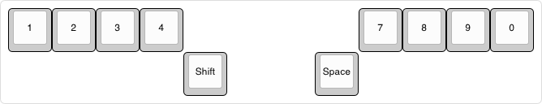

| 1 | 2 | 3 | 4 |Sft|Spc| 7 | 8 | 9 | 0 | Result |
|:---:|:---:|:---:|:---:|:---:|:---:|:---:|:---:|:---:|:---:|---|
| x |   |   |   |[ ]|[ ]|   |   |   |   | 1 |
| x |   |   |   |[x]|[ ]|   |   |   |   | ! |
|   | x |   |   |[ ]|[ ]|   |   |   |   | 2 |
|   | x |   |   |[x]|[ ]|   |   |   |   | @ |
|   |   | x |   |[ ]|[ ]|   |   |   |   | 3 |
|   |   | x |   |[x]|[ ]|   |   |   |   | # |
|   |   |   | x |[ ]|[ ]|   |   |   |   | 4 |
|   |   |   | x |[x]|[ ]|   |   |   |   | $ |
|   |   | x | x |[ ]|[ ]|   |   |   |   | 5 |
|   |   | x | x |[x]|[ ]|   |   |   |   | % |
|   |   |   |   |[ ]|[ ]| x | x |   |   | 6 |
|   |   |   |   |[x]|[ ]| x | x |   |   | ^ |
|   |   |   |   |[ ]|[ ]| x |   |   |   | 7 |
|   |   |   |   |[x]|[ ]| x |   |   |   | & |
|   |   |   |   |[ ]|[ ]|   | x |   |   | 8 |
|   |   |   |   |[x]|[ ]|   | x |   |   | * |
|   |   |   |   |[ ]|[ ]|   |   | x |   | 9 |
|   |   |   |   |[x]|[ ]|   |   | x |   | ( |
|   |   |   |   |[ ]|[ ]|   |   |   | x | 0 |
|   |   |   |   |[x]|[ ]|   |   |   | x | ) |
| x |   |   |   |[ ]|[ ]| x |   |   |   | ` |
| x |   |   |   |[x]|[ ]| x |   |   |   | ~ |
|   |   |   |   |[ ]|[ ]|   | x |   | x | ! |
|   |   |   |   |[x]|[ ]|   | x |   | x | @ |
|   | x | x |   |[ ]|[ ]|   |   |   |   | N/A 0 |
|   |   |   | x |[ ]|[ ]|   |   | x |   | N/A 1 |
| x |   |   | x |[ ]|[ ]|   |   |   |   | { |
| x |   |   | x |[x]|[ ]|   |   |   |   | N/A 2 |
|   |   |   |   |[ ]|[ ]| x |   |   | x | } |
|   |   |   |   |[x]|[ ]| x |   |   | x | N/A 3 |
|   | x |   |   |[ ]|[ ]|   | x |   |   | N/A 4 |
|   | x |   |   |[ ]|[ ]| x |   |   |   | N/A 5 |
|   |   |   |   |[ ]|[ ]|   | x | x |   | N/A 6 |
| x | x |   |   |[ ]|[ ]|   |   |   |   | N/A 7 |
|   |   | x |   |[ ]|[ ]|   |   |   | x | ' |
|   |   | x |   |[x]|[ ]|   |   |   | x | " |
|   |   |   | x |[ ]|[ ]| x |   |   |   | = |
|   |   |   | x |[x]|[ ]| x |   |   |   | + |
|   | x |   | x |[ ]|[ ]|   |   |   |   | N/A 8 |
|   |   |   |   |[ ]|[ ]| x |   | x |   | N/A 9 |
| x |   | x |   |[ ]|[ ]|   |   |   |   | N/A 10 |
|   |   |   | x |[ ]|[ ]|   | x |   |   | N/A 11 |
|   |   | x |   |[ ]|[ ]| x |   |   |   | N/A 12 |
| x |   |   |   |[ ]|[ ]|   | x |   |   | \ |
| x |   |   |   |[x]|[ ]|   | x |   |   | \| |
|   |   |   |   |[ ]|[ ]|   |   | x | x | ; |
|   |   |   |   |[x]|[ ]|   |   | x | x | : |
|   |   | x |   |[ ]|[ ]|   | x |   |   | , |
|   |   | x |   |[x]|[ ]|   | x |   |   | < |
|   | x |   |   |[ ]|[ ]|   |   | x |   | . |
|   | x |   |   |[ ]|[ ]|   |   | x |   | > |
| x |   |   |   |[ ]|[ ]|   |   |   | x | ? |
| x |   |   |   |[x]|[ ]|   |   |   | x | / |
| x |   |   |   |[ ]|[ ]|   |   | x |   | ( |
| x |   |   |   |[x]|[ ]|   |   | x |   | [ |
|   | x |   |   |[ ]|[ ]|   |   |   | x | ) |
|   | x |   |   |[x]|[ ]|   |   |   | x | ] |
|   |   | x |   |[ ]|[ ]|   |   | x |   | - |
|   |   | x |   |[ ]|[ ]|   |   | x |   | _ |
| x |   |   |   |[ ]|[ ]|   | x | x |   | Sticky Ctrl + Alt |
|   | x |   |   |[ ]|[ ]|   | x | x |   | Sticky Ctrl |
|   |   | x |   |[ ]|[ ]|   | x | x |   | Sticky Gui |
|   |   |   | x |[ ]|[ ]|   | x | x |   | Sticky Alt |
|   | x | x |   |[ ]|[ ]|   | x | x |   | Layer 2 |
| x |   |   | x |[ ]|[ ]| x |   |   | x | Layer 0 |
|   |   |   | x |[ ]|[ ]|   |   |   | x | Backspace |
| x | x | x | x |[ ]|[ ]|   |   |   | x | Tab |
|   |   |   |   |[ ]|[ ]| x | x | x | x | Enter |
|   |   |   |   |[x]|[ ]|   |   |   |   | Sticky Shift |
|   |   |   |   |[ ]|[x]|   |   |   |   | Space |

### Layer 2

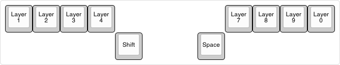

| 1 | 2 | 3 | 4 |Sft|Spc| 7 | 8 | 9 | 0 | Result |
|:---:|:---:|:---:|:---:|:---:|:---:|:---:|:---:|:---:|:---:|---|
| x |   |   |   |[ ]|[ ]|   |   |   |   | Layer 1 |
|   | x |   |   |[ ]|[ ]|   |   |   |   | Layer 2 |
|   | x | x |   |[ ]|[ ]|   | x | x |   | Layer 2 |
|   |   | x |   |[ ]|[ ]|   |   |   |   | Layer 3 |
|   |   |   | x |[ ]|[ ]|   |   |   |   | Layer 4 |
|   |   | x | x |[ ]|[ ]|   |   |   |   | Layer 5 |
|   |   |   |   |[ ]|[ ]| x | x |   |   | Layer 6 |
|   |   |   |   |[ ]|[ ]| x |   |   |   | Layer 7 |
|   |   |   |   |[ ]|[ ]|   | x |   |   | Layer 8 |
|   |   |   |   |[ ]|[ ]|   |   | x |   | Layer 9 |
|   |   |   |   |[ ]|[ ]|   |   |   | x | Layer 0 |
|   |   |   | x |[ ]|[ ]|   |   |   | x | Backspace |
| x | x | x | x |[ ]|[ ]|   |   |   |   | Tab |
|   |   |   |   |[ ]|[ ]| x | x | x | x | Enter |
|   |   |   |   |[x]|[ ]|   |   |   |   | Sticky Shift |
|   |   |   |   |[ ]|[x]|   |   |   |   | Space |

### Layer 3

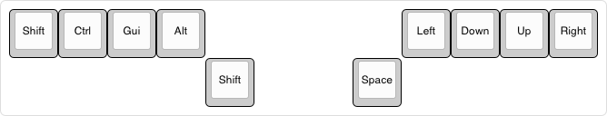

| 1 | 2 | 3 | 4 |Sft|Spc| 7 | 8 | 9 | 0 | Result |
|:---:|:---:|:---:|:---:|:---:|:---:|:---:|:---:|:---:|:---:|---|
| x |   |   |   |[ ]|[ ]|   |   |   |   | Shift |
|   | x |   |   |[ ]|[ ]|   |   |   |   | Ctrl |
|   |   | x |   |[ ]|[ ]|   |   |   |   | Gui |
|   |   |   | x |[ ]|[ ]|   |   |   |   | Alt |
|   |   |   |   |[ ]|[ ]| x |   |   |   | Left |
|   |   |   |   |[ ]|[ ]|   | x |   |   | Down |
|   |   |   |   |[ ]|[ ]|   |   | x |   | Up |
|   |   |   |   |[ ]|[ ]|   |   |   | x | Right |
|   | x | x |   |[ ]|[ ]|   | x | x |   | Layer 2 |
| x | x | x | x |[ ]|[ ]|   |   |   |   | Tab |
|   |   |   |   |[ ]|[ ]| x | x | x | x | Enter |
|   |   |   |   |[x]|[ ]|   |   |   |   | Sticky Shift |
|   |   |   |   |[ ]|[x]|   |   |   |   | Space |

### Layer 4

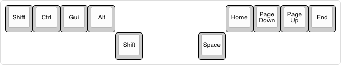

| 1 | 2 | 3 | 4 |Sft|Spc| 7 | 8 | 9 | 0 | Result |
|:---:|:---:|:---:|:---:|:---:|:---:|:---:|:---:|:---:|:---:|---|
| x |   |   |   |[ ]|[ ]|   |   |   |   | Shift |
|   | x |   |   |[ ]|[ ]|   |   |   |   | Ctrl |
|   |   | x |   |[ ]|[ ]|   |   |   |   | Gui |
|   |   |   | x |[ ]|[ ]|   |   |   |   | Alt |
|   |   |   |   |[ ]|[ ]| x |   |   |   | Home |
|   |   |   |   |[ ]|[ ]|   | x |   |   | Page Down |
|   |   |   |   |[ ]|[ ]|   |   | x |   | Page Up |
|   |   |   |   |[ ]|[ ]|   |   |   | x | End |
|   |   |   |   |[ ]|[ ]| x | x |   |   | Forward Delete |
|   |   |   |   |[ ]|[ ]|   | x | x |   | Escape |
|   |   |   |   |[ ]|[ ]|   |   | x | x | Caps Lock |
|   | x | x |   |[ ]|[ ]|   | x | x |   | Layer 2 |
| x | x | x | x |[ ]|[ ]|   |   |   |   | Tab |
|   |   |   |   |[ ]|[ ]| x | x | x | x | Enter |
|   |   |   |   |[x]|[ ]|   |   |   |   | Sticky Shift |
|   |   |   |   |[ ]|[x]|   |   |   |   | Space |

### Layer 5

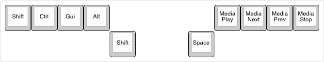

| 1 | 2 | 3 | 4 |Sft|Spc| 7 | 8 | 9 | 0 | Result |
|:---:|:---:|:---:|:---:|:---:|:---:|:---:|:---:|:---:|:---:|---|
| x |   |   |   |[ ]|[ ]|   |   |   |   | Shift |
|   | x |   |   |[ ]|[ ]|   |   |   |   | Ctrl |
|   |   | x |   |[ ]|[ ]|   |   |   |   | Gui |
|   |   |   | x |[ ]|[ ]|   |   |   |   | Alt |
|   |   |   |   |[ ]|[ ]| x |   |   |   | Media Play/Pause |
|   |   |   |   |[ ]|[ ]|   | x |   |   | Media Next |
|   |   |   |   |[ ]|[ ]|   |   | x |   | Media Previous |
|   |   |   |   |[ ]|[ ]|   |   |   | x | Media Stop |
|   | x | x |   |[ ]|[ ]|   | x | x |   | Layer 2 |
| x | x | x | x |[ ]|[ ]|   |   |   |   | Tab |
|   |   |   |   |[ ]|[ ]| x | x | x | x | Enter |
|   |   |   |   |[x]|[ ]|   |   |   |   | Sticky Shift |
|   |   |   |   |[ ]|[x]|   |   |   |   | Space |

### Layer 6

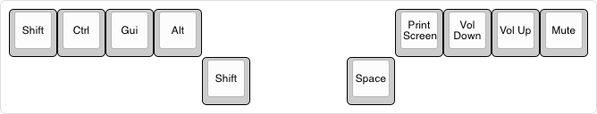

| 1 | 2 | 3 | 4 |Sft|Spc| 7 | 8 | 9 | 0 | Result |
|:---:|:---:|:---:|:---:|:---:|:---:|:---:|:---:|:---:|:---:|---|
| x |   |   |   |[ ]|[ ]|   |   |   |   | Shift |
|   | x |   |   |[ ]|[ ]|   |   |   |   | Ctrl |
|   |   | x |   |[ ]|[ ]|   |   |   |   | Gui |
|   |   |   | x |[ ]|[ ]|   |   |   |   | Alt |
|   |   |   |   |[ ]|[ ]| x |   |   |   | Print Screen |
|   |   |   |   |[ ]|[ ]|   | x |   |   | Volume Down |
|   |   |   |   |[ ]|[ ]|   |   | x |   | Volume Up |
|   |   |   |   |[ ]|[ ]|   |   |   | x | Mute |
|   | x | x |   |[ ]|[ ]|   | x | x |   | Layer 2 |
| x | x | x | x |[ ]|[ ]|   |   |   |   | Tab |
|   |   |   |   |[ ]|[ ]| x | x | x | x | Enter |
|   |   |   |   |[x]|[ ]|   |   |   |   | Sticky Shift |
|   |   |   |   |[ ]|[x]|   |   |   |   | Space |

### Layer 7

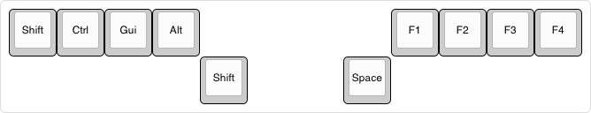

| 1 | 2 | 3 | 4 |Sft|Spc| 7 | 8 | 9 | 0 | Result |
|:---:|:---:|:---:|:---:|:---:|:---:|:---:|:---:|:---:|:---:|---|
| x |   |   |   |[ ]|[ ]|   |   |   |   | Shift |
|   | x |   |   |[ ]|[ ]|   |   |   |   | Ctrl |
|   |   | x |   |[ ]|[ ]|   |   |   |   | Gui |
|   |   |   | x |[ ]|[ ]|   |   |   |   | Alt |
|   |   |   |   |[ ]|[ ]| x |   |   |   | F1 |
|   |   |   |   |[ ]|[ ]|   | x |   |   | F2 |
|   |   |   |   |[ ]|[ ]|   |   | x |   | F3 |
|   |   |   |   |[ ]|[ ]|   |   |   | x | F4 |
|   | x | x |   |[ ]|[ ]|   | x | x |   | Layer 2 |
| x | x | x | x |[ ]|[ ]|   |   |   |   | Tab |
|   |   |   |   |[ ]|[ ]| x | x | x | x | Enter |
|   |   |   |   |[x]|[ ]|   |   |   |   | Sticky Shift |
|   |   |   |   |[ ]|[x]|   |   |   |   | Space |

### Layer 8

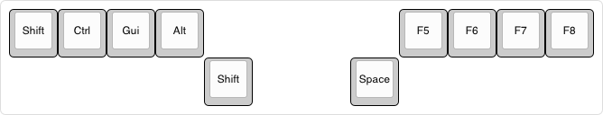

| 1 | 2 | 3 | 4 |Sft|Spc| 7 | 8 | 9 | 0 | Result |
|:---:|:---:|:---:|:---:|:---:|:---:|:---:|:---:|:---:|:---:|---|
| x |   |   |   |[ ]|[ ]|   |   |   |   | Shift |
|   | x |   |   |[ ]|[ ]|   |   |   |   | Ctrl |
|   |   | x |   |[ ]|[ ]|   |   |   |   | Gui |
|   |   |   | x |[ ]|[ ]|   |   |   |   | Alt |
|   |   |   |   |[ ]|[ ]| x |   |   |   | F5 |
|   |   |   |   |[ ]|[ ]|   | x |   |   | F6 |
|   |   |   |   |[ ]|[ ]|   |   | x |   | F7 |
|   |   |   |   |[ ]|[ ]|   |   |   | x | F8 |
|   | x | x |   |[ ]|[ ]|   | x | x |   | Layer 2 |
| x | x | x | x |[ ]|[ ]|   |   |   |   | Tab |
|   |   |   |   |[ ]|[ ]| x | x | x | x | Enter |
|   |   |   |   |[x]|[ ]|   |   |   |   | Sticky Shift |
|   |   |   |   |[ ]|[x]|   |   |   |   | Space |

### Layer 9

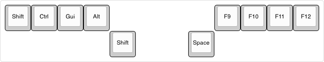

| 1 | 2 | 3 | 4 |Sft|Spc| 7 | 8 | 9 | 0 | Result |
|:---:|:---:|:---:|:---:|:---:|:---:|:---:|:---:|:---:|:---:|---|
| x |   |   |   |[ ]|[ ]|   |   |   |   | Shift |
|   | x |   |   |[ ]|[ ]|   |   |   |   | Ctrl |
|   |   | x |   |[ ]|[ ]|   |   |   |   | Gui |
|   |   |   | x |[ ]|[ ]|   |   |   |   | Alt |
|   |   |   |   |[ ]|[ ]| x |   |   |   | F9 |
|   |   |   |   |[ ]|[ ]|   | x |   |   | F10 |
|   |   |   |   |[ ]|[ ]|   |   | x |   | F11 |
|   |   |   |   |[ ]|[ ]|   |   |   | x | F12 |
|   | x | x |   |[ ]|[ ]|   | x | x |   | Layer 2 |
| x | x | x | x |[ ]|[ ]|   |   |   |   | Tab |
|   |   |   |   |[ ]|[ ]| x | x | x | x | Enter |
|   |   |   |   |[x]|[ ]|   |   |   |   | Sticky Shift |
|   |   |   |   |[ ]|[x]|   |   |   |   | Space |

## QMK Firmware

Neung W Ha has been implemented in three setups:

### Handwired

- QMK Firmware: [Neung W Ha](https://github.com/joakimwinum/qmk_firmware/tree/handwired_neung_w_ha/keyboards/handwired/neung_w_ha)
- Keyboard: [Handwired](https://docs.qmk.fm/hand_wire) (no matrix, [direct pins](https://docs.qmk.fm/easy_maker#direct-pin)) with Raspberry Pi Pico
- Hardware Availability: [Raspberry Pi Pico](https://www.raspberrypi.com/products/raspberry-pi-pico/)

### 3w6 RGB

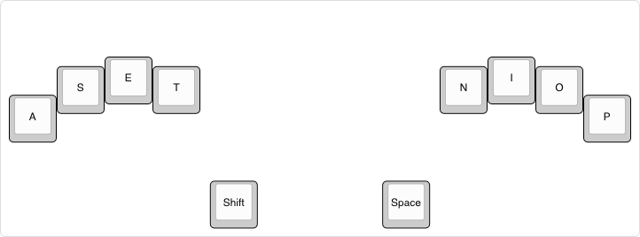

- QMK Firmware: [3w6 Neung W Ha](https://github.com/joakimwinum/vial-qmk-3w6-neung-w-ha/tree/vial/keyboards/keebart/3w6_neung_w_ha)
- Keyboard: [3w6 RGB](https://github.com/weteor/3W6)
- Hardware Availability: [Keebart](https://keebart.com/)

### Piantor

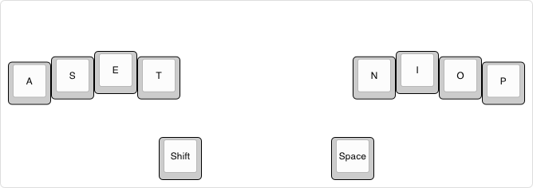

- QMK Firmware: [Piantor Chord](https://github.com/joakimwinum/qmk_firmware/tree/piantor_chord/keyboards/beekeeb/piantor_chord) [_Note: This firmware has not yet been tested_]
- Keyboard: [Piantor](https://github.com/beekeeb/piantor)
- Hardware Availability: [BeeKeeb](https://shop.beekeeb.com)

## License

This project is licensed under the terms of the [GNU General Public License, version 2](https://www.gnu.org/licenses/old-licenses/gpl-2.0.html) or (at your option) any later version.

The full text of the GPL-2.0 license is included in the [LICENSE](./LICENSE) file.
